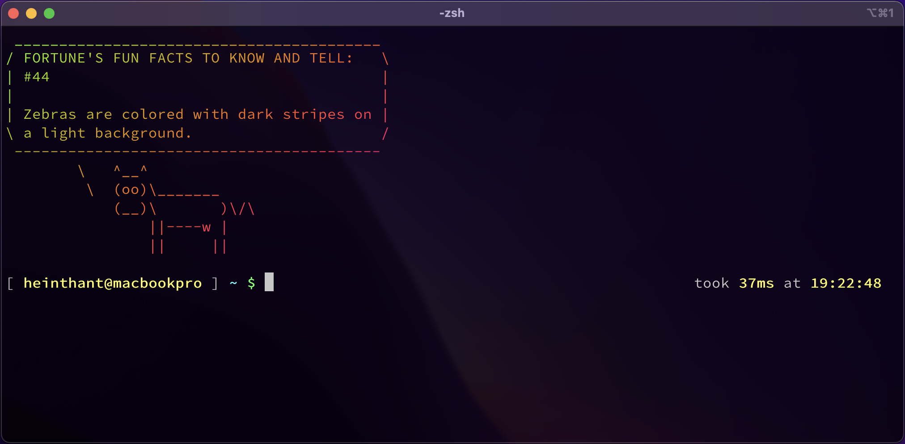
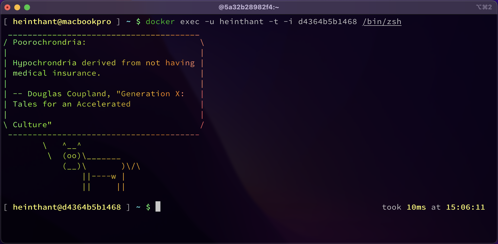

# dots

Hi, there are personal dotfiles of Hein Thant. `zsh` and `antigen` is used so, `bash` or other shells won't work. Shout-out to [chezmoi](https://github.com/twpayne/chezmoi), being an awesome dotfiles manager.

## Notes

For macOS,

- `brew` must be installed
- `eval $(/opt/homebrew/bin/brew shellenv)` must be run once before importing ( on fresh new machine ). Otherwise u will get `zsh: command not found: brew`.

For Linux, not supported for now ( since I haven't write scripts for it ). For Windows, well, I don't use it. So, I don't know.

## How to Import

Run the following command.

```shell
sh -c "$(curl -fsLS https://chezmoi.io/get)" -- init --apply heinthanth/dots
```

Answer a few questions and done!

> I use LastPass so much than other. So, I use LastPass to store SSH. So, if u don't use LastPass or SSH isn't stored in LastPass, please answer "No to import SSH" when asked so that, it won't fail.

## Screenshots

MacBook Pro (13-inch, M1, 2020)



Fedora ( Docker, ARM64 )



## References

- <https://www.chezmoi.io>
- <https://jerrynsh.com/how-to-manage-dotfiles-with-chezmoi>
- <https://fedoramagazine.org/take-back-your-dotfiles-with-chezmoi>

RTFM is the best method ever.
